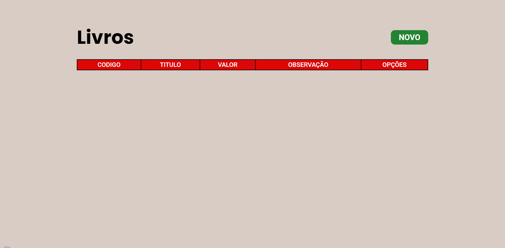

<h1 align="center"> Crud Simples </h1>

    

Projeto Crud (Create, Read, Update, Delete) Simples para livros.

## Descrição

O projeto é um crud de livros aonde é possível cadastrar, alterar, ler e excluir registro de livros no banco de dados. Para isso foi utilizando o PHP para realizar execução de instruções SQL no banco de dados phpMyAdmin, além disso foi utilizado POO (Programação Orientada a Objetos), PDO (PHP Data Object) e DAO (Data Access Object) na construção das class. Na arquitetura do projeto foi utilizado a ideia do MVC (Model View Controller) para que assim as class ficassem separadas permitindo melhor manutenção do código. Na pasta DOC você encontra todo o planejamento do projeto como o desenho da modelagem do banco de dados, diagrama UML das class utilizadas e o próprio banco de dados exportado. 

## Funcionalidades:

* Cadastro de livros
* Leitura dos livros que foram cadastrados
* Atualização de livros 
* Remoção de livros
* Confirmações de exclusão
* Validação de Campos 
* Campo especial de cadastro

## Dados que Foram Utilizados nos Campos:

* Titulo do Livro
* Codigo (Campo especial)
* Autor (opcional)
* Genero
* Situação
* Valor
* Idioma
* Observação (opcional)

## Status do Projeto

**Concluido**: O projeto esta terminado, não havera futuras alterações de funcionalidade.

## Construído com

* [HTML](https://www.w3schools.com/html/) - HTML abreviação para a expressão inglesa HyperText Markup Language, que significa: "Linguagem de Marcação de Hipertexto" é uma linguagem de marcação utilizada na construção de páginas na Web. Documentos HTML podem ser interpretados por navegadores. A tecnologia é fruto da junção entre os padrões HyTime e SGML.

* [CSS](https://www.w3schools.com/css/default.asp) - Cascading Style Sheets é um mecanismo para adicionar estilo a um documento web. O código CSS pode ser aplicado diretamente nas tags ou ficar contido dentro das tags "style". Também é possível, em vez de colocar a formatação dentro do documento, criar um link para um arquivo CSS que contém os estilos.

* [JavaScript](https://developer.mozilla.org/pt-BR/docs/Web/JavaScript) - CJavaScript é uma linguagem de programação interpretada estruturada, de script em alto nível com tipagem dinâmica fraca e multiparadigma. Juntamente com HTML e CSS, o JavaScript é uma das três principais tecnologias da World Wide Web.

* [PHP](https://www.php.net/manual/pt_BR/intro-whatis.php) - PHP é uma linguagem interpretada livre, usada originalmente apenas para o desenvolvimento de aplicações presentes e atuantes no lado do servidor, capazes de gerar conteúdo dinâmico na World Wide Web.

* [SQL](https://www.w3schools.com/sql/) - Structured Query Language, ou Linguagem de Consulta Estruturada ou SQL, é a linguagem de pesquisa declarativa padrão para banco de dados relacional. Muitas das características originais do SQL foram inspiradas na álgebra relacional.

## Versão das Linguagens e Ferramentas

#### Servidor de base de dados

* MariaDB - 10.4.14-MariaDB

#### Servidor web

* PHP - 7.4.11
* Apache - 2.4.46

#### Gerenciamento do banco de dados

* phpMyAdmin - 5.0.3

#### Ferramentas

* Xampp - 3.2.4

## Autor

* **Cesar dos Santos de Almeida** - *responsável pela construção e desenvolvimento do projeto*

## Licença

Este projeto está licenciado sob a licença MIT - consulte o arquivo  [LICENSE.md](LICENSE.md) para obter detalhes

## Links

* [Layout do Projeto](https://www.figma.com/file/8PphXdOudTbOpwl6Jwq7MN/crud-simples?node-id=0%3A1) - Link do projeto no figma
* [Demo do projeto](http://csantosalmeida.rf.gd/crud/) - Link da Demo

